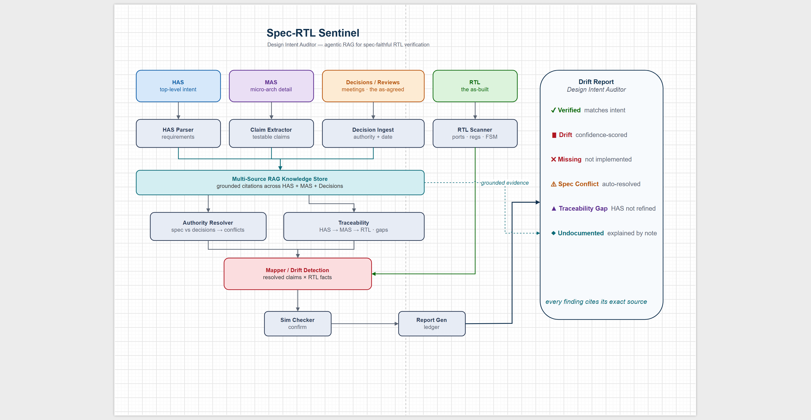
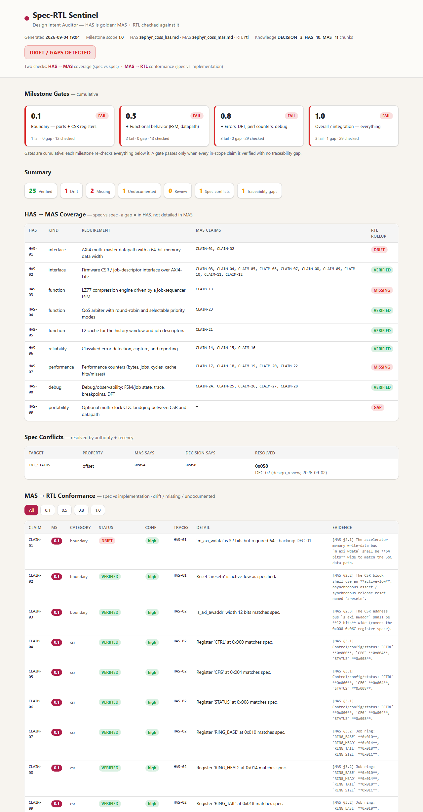

# Spec-RTL Sentinel — Design Intent Auditor

**Agentic RAG that checks RTL against the *entire chain of design intent* — HAS → MAS → decisions → RTL — and reports where the as-built silicon drifts from the as-agreed intent.**

---

## The problem

RTL is implemented from a **MAS** (Micro-Architecture Spec), which refines a
**HAS** (High-level Architecture Spec). But the *real* decisions — "we widened
the bus to 64-bit", "STATUS moved to 0x08" — live in **architecture reviews,
design reviews, and meeting notes**, and rarely make it back into the formal
specs. Over time, HAS, MAS, decisions, and RTL all drift apart. Manual
clause-by-clause review across all these sources is slow, inconsistent, and the
first thing dropped under schedule pressure — and a missed mismatch can become a
functional bug or a security hole in silicon.

## What it does

Sentinel ingests **every layer of design authority** into a RAG store and
grounds RTL against all of them at once:

```
   HAS   (performance / concept — the "why")
     |  refined by
   MAS   (micro-architecture detail — the "what")
     |  amended by
   Decisions / reviews / meetings (the "as-agreed")
     |  implemented as
   RTL   (the "as-built")
```



It runs **two checks** and produces a **layered drift report**:

1. **HAS → MAS coverage** *(spec vs spec)* — does every top-level HAS
   requirement have a MAS claim refining it? A **gap** means the intent is in
   the HAS but was never detailed in the MAS, so it can't be verified.
2. **MAS → RTL conformance** *(spec vs implementation)* — does the RTL implement
   each MAS claim? Reports **drift** (implemented differently), **missing** (not
   implemented), and **undocumented** (in RTL but no claim), each with a
   **confidence** level and grounded evidence.
3. **Spec conflicts** — where a review/decision contradicts the MAS, resolved by
   **authority + recency** (arch review > design review > meeting > spec); the
   RTL is checked against the *resolved* intent, and the stale MAS is flagged.

**Anti-hallucination by design:** every finding cites the exact source (HAS/MAS
clause or decision id) it is grounded in. Nothing is asserted without a
reference retrieved from the knowledge store.

## Why it's different

Traditional lint/spec-check tools compare RTL to **one** document. Sentinel is
the only one that indexes the **tribal layer** — the decisions in reviews and
chats — and reconciles *source-vs-source* conflicts before even looking at the
RTL. That's drift no single-document checker can catch.

## The agents

| Agent | Role |
| --- | --- |
| **HAS Parser** | Extracts top-level requirements (performance / concept / security) |
| **Claim Extractor** | Turns the MAS into testable claims, each traced to a HAS requirement |
| **Decision Ingest** | Ingests reviews/meetings with authority + date metadata |
| **Authority Resolver** | Reconciles spec vs decisions by authority + recency; flags conflicts |
| **Traceability** | Checks HAS -> MAS coverage; rolls RTL status up to each HAS requirement |
| **RTL Scanner** | Parses SystemVerilog into structured facts (port widths, CSR map, FSM) |
| **Mapper / Diff** | Diffs resolved claims vs RTL; classifies + attaches the evidence chain |
| **Sim Checker** | Confirms dynamic claims via simulation (Icarus Verilog) |
| **Report Generator** | Emits the layered Design Intent Auditor report |

All grounded in a dependency-free **RAG store** (`src/knowledge/rag_store.py`).

## Quick start

```bash
python run_demo.py
```

Runs **fully offline** (no API keys) over a bundled synthetic example — the
**Zephyr LZ Compression Offload Sub-System (COSS)**: a firmware-driven AXI
compression accelerator (HAS + MAS + review decisions + RTL). The RTL faithfully
implements the MAS except for a few deliberately injected drifts, and the
decisions include one **reinforcing** review (64-bit datapath), one
**conflicting** review (INT_STATUS offset), and one **contextual** note
(temporary debug register) — so you see the tool catch drift, resolve a spec
conflict, flag a traceability gap, and explain an undocumented register.

Two reports are written on every run:

- `reports/drift_report.md` — the markdown report
- `reports/drift_report.html` — a **self-contained, styled dashboard** (no
  external resources; opens locally or shares as a single file)

## The dashboard UI



The HTML report renders milestone gate cards, summary chips, the HAS→MAS→RTL
traceability table, resolved spec conflicts, and a **milestone-filterable**
clause-by-clause findings table — each finding citing its exact source. It
adapts to light/dark theme automatically. A rendered sample lives at
[`docs/sample_drift_report.html`](docs/sample_drift_report.html).

### What the demo catches

On the Zephyr COSS example (28 MAS claims, 9 HAS requirements, 3 decisions):

- **Drift (high confidence, 0.1)** — RTL memory bus `m_axi_wdata` is 32-bit; the MAS *and* the Aug-28 arch review both require 64-bit.
- **Missing (0.5)** — the control FSM lacks the `WRITE_OUT` state required by MAS §4.1.
- **Missing (0.8)** — the `PERF_MISS` performance counter (MAS §3.3) is not implemented.
- **Spec conflict, auto-resolved** — `INT_STATUS`: the MAS says 0x054 but the Sep-02 design review relocated it to 0x058; the RTL follows the review, so Sentinel resolves the conflict (authority + recency) and marks the RTL correct while flagging the stale MAS.
- **Undocumented, explained** — a `DBG_SCRATCH` register at 0x070 in the RTL that no spec mentions, but an Aug-20 meeting note flags it as a temporary bring-up hook.
- **Traceability gap (1.0)** — HAS-09 (optional multi-clock CDC) was never refined into a MAS claim.

## Milestone-based checking

HAS is the **golden reference** — it is never flagged. MAS and RTL are checked
against it **milestone by milestone**, where each milestone only checks the
parameters relevant at that stage (cumulatively):

| Milestone | Scope (what gets checked) |
| --- | --- |
| **0.1** | Boundary — interface ports + CSR registers |
| **0.5** | + Functional behavior (FSM, datapath) |
| **0.8** | + Errors, DFT, perf counters, debug |
| **1.0** | Overall / integration — everything |

Every run prints a **milestone gate table** — is the RTL 0.1-clean? 0.5-clean? —
and you can scope a run to one milestone:

```bash
python run_demo.py --milestone 0.1   # only boundary + CSR
python run_demo.py --milestone 0.5   # + functional
python run_demo.py                    # 1.0 (everything, default)
```

Gates are cumulative: a milestone passes only when every in-scope claim is
verified with no traceability gap. In the demo, **all four gates fail** — 0.1
already fails on the 32-bit-vs-64-bit datapath drift, so the RTL isn't even
0.1-ready yet; 0.5 adds the missing FSM state, 0.8 the missing perf counter, and
1.0 the CDC traceability gap.

## RAG / LLM upgrade path

The demo uses deterministic extraction and an offline TF-cosine RAG index so
it's reproducible with zero setup. Documented hooks upgrade it to a full system:

1. **RAG store** (`src/knowledge/rag_store.py`) — swap the TF-cosine index for
   Azure OpenAI embeddings + ChromaDB / FAISS. Public API is unchanged.
2. **Claim Extractor** (`src/agents/claim_extractor.py`) — `_extract_with_llm()`
   extracts claims (and their HAS trace) from free-form prose via Azure OpenAI.
3. **RTL Scanner** (`src/agents/rtl_scanner.py`) — swap the regex parser for a
   real HDL parser (`pyslang` / `pyverilog`) for full-design scale.
4. **Decision Ingest** — point it at live sources (Teams, ADO review comments,
   meeting transcripts) instead of files.

## Project layout

```
data/doc/          Zephyr COSS HAS + MAS (requirements + testable claims)
data/decisions/    review/meeting decisions (authority + date)
data/rtl/          Zephyr COSS SystemVerilog (multi-file: top, CSR, FSM,\n                     arbiter, cache, accelerator; with injected drift)
docs/reference/    original source docs (.docx) + design draw.io diagrams
src/knowledge/     multi-source RAG store
src/agents/        the agents (parse, ingest, resolve, trace, scan, map, sim)
src/milestones.py    milestone scope + cumulative gate logic
src/orchestrator.py  end-to-end pipeline
src/report.py        layered markdown report generator
src/report_html.py   self-contained HTML dashboard generator
run_demo.py            CLI entry point
```

## Data note

All bundled HAS/MAS/decision/RTL content is **synthetic** and contains no
confidential material. Do not commit proprietary specs, review notes, or RTL to
this repository.

## License

MIT — see [LICENSE](LICENSE).
